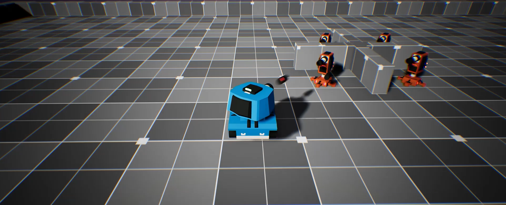
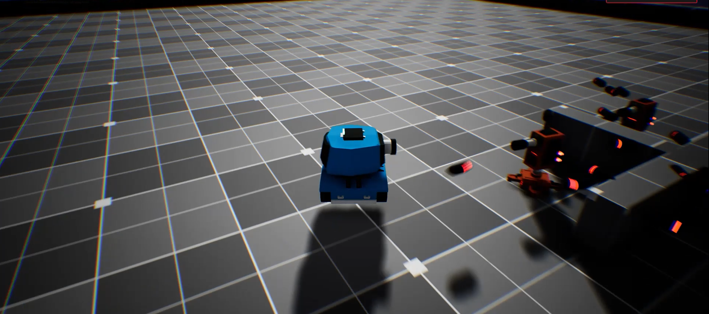
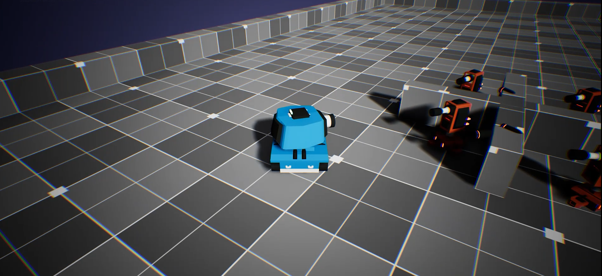

# 🛡️ Toon Tanks – Blast, Dodge, and Dominate!

**Toon Tanks** is a fast-paced, skill-based tank combat game where you take control of a powerful blue tank and battle against AI-driven enemies in a dynamic arena setting.

---

## 🎮 Gameplay Overview

Welcome to **Toon Tanks**, where explosive action meets strategic movement!

- 🛞 Take control of a fully drivable blue tank
- 🎯 Aim and shoot powerful shells at enemy units
- 🧠 Face AI enemies that can also aim and fire at you
- 🏆 Destroy all opponents and survive the battle to win the match!

The enemies aren't just standing around — they actively **track you**, **shoot at you**, and try to **eliminate you**. You'll need precision, reflexes, and timing to outmaneuver them.

---

## 💣 Features

- 💥 Explosive tank combat
- 🎮 Smooth and responsive controls
- 🧠 Basic enemy AI: tracking, aiming, and firing
- 🗺️ Central arena structure adds cover and tactics
- 💀 Risk and reward — they can destroy you too!

---

## 🧠 What You'll Learn (if you're a developer/player)

- Rigidbody-based movement & shooting mechanics
- AI target tracking and projectile firing
- Game state handling (win/lose conditions)
- Physics-based collisions and health management

Whether you're playing or building, this game teaches tons of game dev skills while delivering fast action fun.

---

## 🖼️ Screenshots

### 🔵 Your Tank in Action

### 🎯 Taking Out the Enemy

### 💀 Risk of Getting Hit

---

## 🎥 Gameplay Video

---

## 🛠️ Built With

- 🧱 **Unity Engine**
- 🚀 Rigidbody physics for tank movement and bullets
- 🧠 Basic AI behavior scripting
- 💡 Particle systems for explosions and hits
- 🔊 Sound FX for shots, hits, and destruction

---

## 🏁 Objective

Destroy all enemy tanks without getting blown up.  
**Survive. Dominate. Win.**

---

## 📬 Contact

Created by [Muhammed Alperen Karaçete]  
For questions or collaboration: [m.alperenk@gmail.com]
